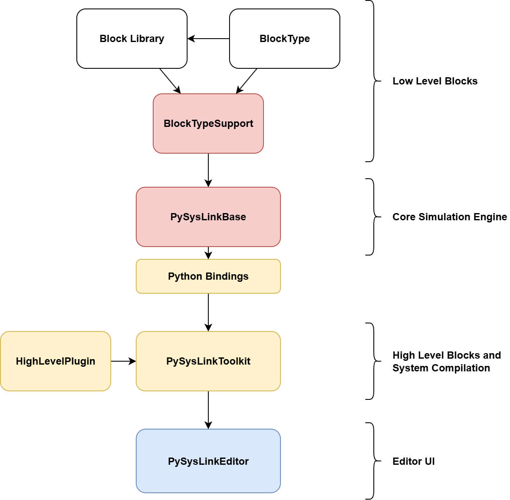

# PySysLink – Open Source Block-Based Simulation Framework

**PySysLink** is a modular, open source simulation framework inspired by tools like Simulink. Designed for scientific computing, control engineering, and dynamic system modeling, PySysLink lets you define and simulate complex systems using a flexible architecture powered by **C++**, **Python**, and **VSCode**.

📘 **Documentation**: [https://pysyslink.readthedocs.io/en/latest/](https://pysyslink.readthedocs.io/en/latest/)
**Github Organization**: [https://github.com/PySysLink](https://github.com/PySysLink)

## 🧩 What is PySysLink?

PySysLink is an open and extensible alternative to proprietary simulation tools. It allows users to:

- ⚙️ **Define simulation models** using a visual block editor.
- 🔄 **Run dynamic system simulations**, model physical systems, control loops, and cyber-physical architectures in a unified simulation engine.
- 🧱 **Create and load plug-ins** for defining new blocks with greate flexibility.
- 🐍 **Control simulations from Python**, using high-performance bindings to the C++ core.

## 🚀 Key Features

- **Modular Architecture:** Core simulation logic is decoupled from block implementations.
- **Plug‑In Support:** Easily add new block libraries without modifying the core engine.
- **C++ Core, Python Integration:** Use a high-performance C++ backend with Python interfaces for parameter initialization, execution, and full simulation control
- **Text-Based Model Definitions:** Easily write and share simulation models using human-readable config files.
- **Open and Community‑Driven:** An open source alternative to proprietary simulation tools, built using widely adopted programming standards.

## PySysLink Structure

### Simulation Workflow

Below is the end‑to‑end flow of a typical PySysLink simulation:

1. **Visual Modeling**  
   - You design your system in **PySysLinkEditor** (a VS Code extension) using a drag‑and‑drop block interface.  
   - The editor saves your model as a JSON document with **high‑level blocks**, visual coordinates, and parameter expressions.

2. **Compilation**  
   - When you launch a simulation, the **PySysLinkToolkit** (Python library) transforms the high‑level JSON into a **low‑level YAML** representation.  
   - The YAML model contains only elemental, simulable blocks, without UI metadata or nested subsystems.

3. **Simulation Execution**  
   - **PySysLinkBase** (C++ core engine) loads the YAML file, instantiates each block, and runs the simulation loop.  
   - Outputs are written to JSON or HDF5 files for further analysis.

4. **Result Visualization**  
   - Back in VS Code, **PySysLinkEditor** reads the simulation outputs and renders plots or display blocks inline, giving you immediate feedback on your model’s behavior.

---

### Plugin Architecture

PySysLink’s power comes from its flexible plug‑in model, allowing you to extend both high and low‑level functionality without touching the core code:

#### 1. Low‑Level Plug‑Ins (PySysLinkBase)

- **BlockTypeSupport Modules**  
  - Each implements a factory for `ISimulationBlock`, the C++ base class for all low‑level blocks.  
  - They **translate** an abstract BlockType interface (which could be defined in C++, Python, Fortran, or an FMU) into concrete `ISimulationBlock` instances.  
  - **Block libraries** (e.g., `BlockLibrariesBasicBlocksBasicCpp`) are simply shared‑library plug‑ins that the BlockTypeSupport module dynamically loads at runtime.

- **Typical Pattern**  
  1. **Define** a language‑agnostic BlockType interface (e.g., methods for `initialize()`, `step()`, `output()`).  
  2. **Implement** concrete blocks in a library (C++, FMU, Python…).  
  3. **Write** a BlockTypeSupport plug‑in that loads those libraries, instantiates blocks, and registers them with the engine.

#### 2. High‑Level Plug‑Ins (PySysLinkToolkit)

- **Python‑based Block Templates**  
  - Reside in a plugin folder or distributed via pip entry points.  
  - Each template YAML declares:
    - **Display metadata**: icon, port layout, parameter form.
    - **Conversion logic**: a Python converter class that takes high‑level properties and emits one or more low‑level block descriptors (and links).

- **Examples**
  - **Neural-network neuron**  
    A high-level neuron block might expand into three low-level blocks:  
    1. A **Constant** block providing the bias value.  
    2. An **Adder** block combining the weighted input and bias.  
    3. An **Activation** block applying the sigmoid function.  
    The converter handles creating these blocks and wiring them together under the hood.

  - **Scope block**  
    - This block compiles to a lower-level display block that instructs the simulation engine to record its input signal during the run.
    - Provides a Matplotlib-based plot back to the editor after simulation.

#### 3. Editor Integration (PySysLinkEditor)

- **Decoupled UI**  
  - Renders the block palette from Toolkit’s high‑level templates.  
  - Sends JSON models to Toolkit for compilation and to Base for simulation via the Python server.

- **Run‑Time Messaging**  
  - Receives progress, display, and plot events from the simulation server.  
  - Displays live plots, numeric displays, and diagnostics inline.

---

By separating **UI**, **compilation**, and **execution** into distinct layers—each extensible via plug‑ins—PySysLink lets you:

- **Swap in new block types** (e.g., FMUs, custom control algorithms) at either the high‑ or low‑level.  
- **Customize compilation** of high‑level constructs into optimized C++ blocks.  
- **Maintain a clean core** engine, while fostering community‑driven extensions and libraries.  

## Components of PySysLink

PySysLink is built as a **modular simulation platform** with a layered architecture and a plugin-based design. Each core component focuses on a specific responsibility: from graphical editing and high-level model compilation, to simulation execution and result visualization. This modular structure enables high flexibility, portability, and extensibility.

Below is an overview of the key software components that make up the PySysLink ecosystem.

---

### 1. **PySysLinkBase** – Core Simulation Engine

`PySysLinkBase` is the high-performance C++ core responsible for executing dynamic system simulations. It provides:

- A well-defined plugin interface to load and simulate low-level blocks.
- Support for both continuous-time and discrete-time systems.
- Event-driven and time-stepped simulation infrastructure.
- Output generation in formats like JSON and HDF5.

The engine is **plugin-agnostic**: it does not hardcode any block functionality but instead dynamically loads implementations at runtime through `BlockTypeSupport` modules.

---

### 2. **BlockTypes** – Abstract Interfaces for Blocks

BlockTypes repositories (e.g., `BlockTypesBasicCpp`) define **language-specific base classes** and **abstract interfaces** for writing block libraries. These are:

- Independent of PySysLinkBase and its internals.
- Designed to provide a clean API for developers to write reusable simulation blocks.
- Lightweight and decoupled, so they can be reused in other simulation backends if needed.

For example, a developer can write C++ blocks that inherit from `BasicCppBlock`, defined in `BlockTypesBasicCpp`, without any dependency on PySysLinkBase itself.

---

### 3. **BlockTypeSupports** – Bridges Between Blocks and the Core Engine

`BlockTypeSupport` modules (e.g., `BlockTypeSupportsBasicCpp`) **translate a block type into something PySysLinkBase can simulate**. These act as adapters and include:

- A factory that creates `ISimulationBlock` instances for blocks defined via a specific `BlockType`.
- Runtime logic to dynamically load external block libraries.
- Optional bindings to support non-C++ block types (e.g., FMU, Fortran, or Python blocks).

These modules depend on both PySysLinkBase and a specific `BlockTypes` repository. They register with the engine as plugins and handle the instantiation and interfacing of concrete block implementations.

---

### 4. **BlockLibraries** – Concrete Block Implementations

BlockLibraries (e.g., `BlockLibrariesBasicBlocksBasicCpp`) provide **fully implemented simulation blocks**, such as:

- Constant
- Adder
- Integrator
- Display

These blocks inherit from interfaces in a specific `BlockTypes` repository and are loaded at runtime by the corresponding `BlockTypeSupport` module.

Naming conventions help organize them clearly:
- They usually begin with `BlockLibraries`
- They end with an identifier like `BasicCpp` to indicate compatibility

Each library is focused, for example offering "basic math blocks" or "control system utilities."

---

### 5. **PySysLinkBasePythonBindings** – Python Access to the C++ Core

This package exposes the functionality of `PySysLinkBase` to Python using a **nanobind** interface, automatically generated by **Litgen**.

It allows:
- Full control over simulation setup and execution from Python.
- Integration with Python-based preprocessing or postprocessing tools.
- Scripting and automation of simulation workflows.

Bindings make it easier to manage low level details of the simulation for developers not familiar with C++, but especially it allows the PySysLinkToolkit to access PySysLinkBase.

---

### 6. **PySysLinkToolkit** – Model Compilation and Plugin Management

`PySysLinkToolkit` is a **Python library** responsible for:

- Managing high-level system models defined in JSON-based `.pslk` files.
- Compiling those high-level models into low-level YAML simulation configurations.
- Managing the plugin system for high-level blocks.
- Providing the metadata required by the graphical editor (block appearance, categories, palette, etc.).

It serves as the **data layer** of the PySysLinkEditor and as the logic layer for model transformation.

---

### 7. **PySysLinkEditor** – Visual Block Editor for VSCode

This is a **VSCode extension** that provides a graphical interface for designing simulation models using a block-diagram-based editor. Features include:

- Drag-and-drop block editing.
- JSON-based model serialization (`.pslk` format).
- Integration with `PySysLinkToolkit` for block metadata and compilation.
- Simulation launching and result visualization, connected with the backend.

The editor supports dynamic updates, block palettes, connection validation, and custom rendering.

---

### 8. **High-Level Block Plugins** – Visual and Compilation Logic

High-level blocks, defined and loaded by `PySysLinkToolkit`, contain:

- **Display logic:** how the block appears visually in the editor.
- **Compilation logic:** how it converts to one or more low-level blocks and links.

Blocks can also define field logic and expression parsing (e.g., allowing the use of Python expressions like `np.sin(t)` or parameter references in the block fields).

---

## Summary of Workflow

1. **Model Editing**  
   Design your model visually using the PySysLinkEditor. Save the `.pslk` file (JSON-based format).

2. **Model Compilation**  
   `PySysLinkToolkit` compiles the model into a low-level YAML representation.

3. **Simulation Execution**  
   `PySysLinkBase` loads the YAML, instantiates the required plugins, and runs the simulation.

4. **Result Visualization**  
   Output data (e.g., from display blocks) is stored in files and optionally visualized in the editor.

5. **Extensibility**  
   Add new functionality by writing:
   - New high-level block plugins (for UI and compilation).
   - New block libraries (in C++, Python, or FMU).
   - New BlockTypeSupport modules to integrate different simulation technologies.
